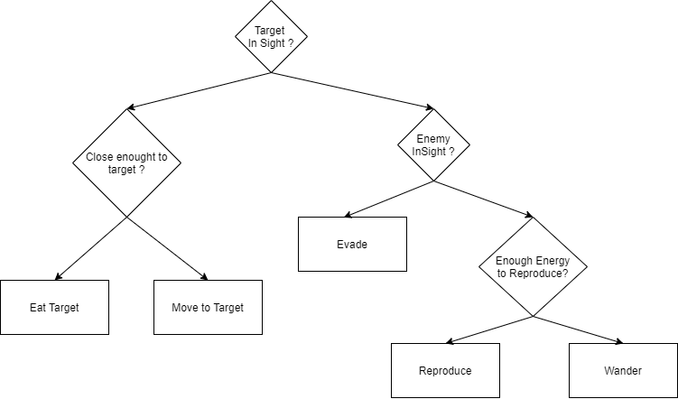

# Report on the 2st Artificial Intelligence Project

## Happy Peixinhos

## AI name: UwU

**Project carried out by:**
- [Rita Saraiva, a21807278](https://github.com/RitaSaraiva)

## Description of the solution

### General Solution

#### FishesBehaviour

#### Decision Tree

Relativamente ás decision trees usei como principal inspiração a soluçao dos exercicios
relacionados com a matéria de decisões, mais especificamente o que tem o enunciado 
com peixes com compurtamentos semelhantes. Existe apenas uma arvore neste caso pois devido
ao facto de cada peixe ter o seu proprio comportamento individual não há necessidade
de criar duas para os peixes grandes e para peixes medios/pequenos.
Relativamente á implementação utilizei como base o modelo disponibilizado pelo professor

## References

### Code

1.  **AIUnityExamples** - MovementOptimize, SimpleDecisionTrees  (provided by the 
                          professor), 
    https://github.com/fakenmc/AIUnityExamples/tree/master/MovementOptimize
    https://github.com/fakenmc/AIUnityExamples/tree/master/SimpleDecisionTrees

### Website

1. https://www.youtube.com/watch?v=Duy4ZrT8STw - Final Wander Movement 
2. https://youtu.be/-tfWYnOs2Ss - First Wander Movement 
3. https://answers.unity.com/questions/986723/how-would-i-make-a-object-flee-from-player.html - Flee Movement
4. https://docs.unity3d.com/2021.1/Documentation/Manual/UnityManual.html - Overall Assistance
5. https://pt.stackoverflow.com/ - Overall Assistance

### Help from colleagues

1. Pedro Inácio(21802050) - Help to better understand how Decision Trees work 
			  - Help to implement the TargetInSight method
			  - Help with mantaining the fishes inside Game Area

### Moodle Exercices

1-

